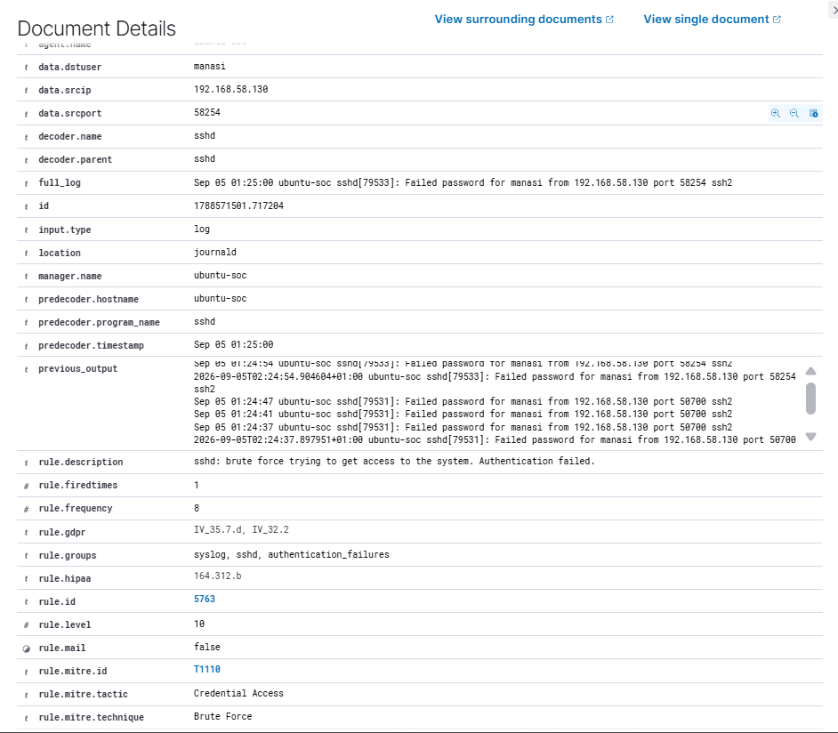
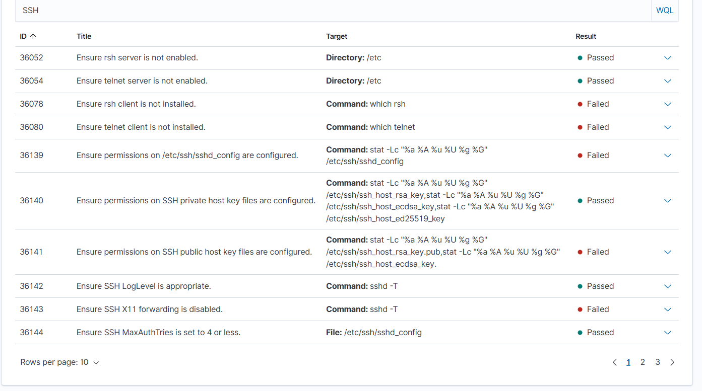

# Wazuh SOC Home Lab: Detection, Investigation & Hardening

A hands-on Security Operations Centre (SOC) lab built in VMware to practise security monitoring, alert triage, incident response and endpoint hardening with the **Wazuh** SIEM/XDR platform (version 4.14.7).

> **Disclaimer:** All activity was performed in an isolated lab environment that I own. No real systems or networks were targeted.

---

## Project Summary

I deployed a single-node Wazuh platform on Ubuntu, onboarded a Kali Linux endpoint as a monitored agent, and then worked through three realistic SOC use cases:

1. **Authentication monitoring:** detected and investigated a simulated SSH brute-force attack.
2. **File Integrity Monitoring (FIM):** detected file creation, modification and deletion in real time.
3. **Security Configuration Assessment (SCA):** found a failed CIS benchmark control, remediated it, and verified the fix.

Each section follows the same analyst workflow: *objective, action, reason, result, SOC interpretation, evidence.*

---

## Lab Architecture

```
Windows host
     |
VMware Workstation (NAT / lab network)
     |
+---------------------------------------------+
|                                             |
Kali Linux (kali-lab)        Ubuntu 24.04 (ubuntu-soc)
192.168.58.130               192.168.58.131
Wazuh Agent                  Wazuh Manager
Controlled test endpoint     Wazuh Indexer
                             Filebeat
                             Wazuh Dashboard
+---------------------------------------------+
```

**Data flow:** Security event → Wazuh Agent → Wazuh Manager → Filebeat → Wazuh Indexer → Wazuh Dashboard

| Host | Role | IP | Resources |
|---|---|---|---|
| `ubuntu-soc` | Wazuh central server and SSH target | 192.168.58.131 | 4 CPU, ~6 GB RAM, 50 GB disk |
| `kali-lab` | Wazuh agent and controlled test source | 192.168.58.130 | n/a |

| Component | Purpose |
|---|---|
| Wazuh Manager | Analyses events and evaluates detection rules |
| Wazuh Indexer | Stores and indexes security data for search |
| Filebeat | Ships alerts from the Manager to the Indexer |
| Wazuh Dashboard | Web interface for hunting and investigation |

---

## Key Results

| Scenario | Detection | Outcome |
|---|---|---|
| SSH brute force | Rule **5760** (single failure) → Rule **5763** (Level 10, MITRE **T1110**) | Source IP, target user and timeline identified; **no successful login** found in the incident window |
| FIM: file created | Rule **554** (Level 5) | Detected in real time |
| FIM: file modified | Rule **550** (Level 7) | Detected, hashes and attributes changed |
| FIM: file deleted | Rule **553** (Level 7) | Detected in real time |
| SCA: SSH hardening | CIS check **36144** (`MaxAuthTries`) failed | Remediated (`MaxAuthTries 4`), re-scanned, check **passed** |

### Evidence preview

**Brute-force correlation alert (Rule 5763, Level 10, MITRE T1110)**



**SCA check 36144 after remediation: Passed**



---

## Skills Demonstrated

- **SIEM deployment:** single-host Wazuh install (Indexer, Manager, Filebeat, Dashboard)
- **Endpoint onboarding:** agent installation, repository signing key, manager configuration
- **Log analysis:** `journalctl`, `/var/log/auth.log`, Wazuh Threat Hunting and Events views
- **Detection engineering concepts:** reading Wazuh rules (`0095-sshd_rules.xml`), understanding correlation (frequency and timeframe)
- **Incident response:** identify, validate, investigate, contain, remediate, recover, document
- **MITRE ATT&CK mapping:** T1110 Brute Force (Credential Access)
- **File Integrity Monitoring:** real-time `syscheck` configuration and alert triage
- **Security hardening:** CIS benchmark review and SSH remediation with validation
- **Troubleshooting:** Indexer permission failure, stopped Manager, stopped Filebeat

---

## Project Walkthrough

| Part | Topic | Write-up |
|---|---|---|
| 1 | Lab deployment and Wazuh setup | [docs/01-lab-setup-and-deployment.md](docs/01-lab-setup-and-deployment.md) |
| 2 | SSH brute-force detection and investigation | [docs/02-ssh-bruteforce-investigation.md](docs/02-ssh-bruteforce-investigation.md) |
| 3 | File Integrity Monitoring | [docs/03-file-integrity-monitoring.md](docs/03-file-integrity-monitoring.md) |
| 4 | Security Configuration Assessment | [docs/04-security-configuration-assessment.md](docs/04-security-configuration-assessment.md) |
| - | Troubleshooting log | [docs/05-troubleshooting-log.md](docs/05-troubleshooting-log.md) |
| - | Incident report | [reports/incident-report-ssh-bruteforce.md](reports/incident-report-ssh-bruteforce.md) |
| - | Command reference | [commands.md](commands.md) |

---

## Highlights From the Investigation

**SSH brute force (Part 2)**
A failed login is an event, not automatically an incident. I generated a normal successful SSH login first to learn the baseline, then controlled failed attempts from Kali. Wazuh flagged individual failures with Rule 5760 and correlated repeated failures with Rule 5763. I validated the alert against Ubuntu's SSH journal, built a timeline, and searched for `Accepted` events to confirm there was no successful access. I did not permanently block the source because it was my own controlled lab endpoint.

**File Integrity Monitoring (Part 3)**
The first test produced no alert. Rather than guessing, I traced the full event path and found that the Wazuh Manager and then Filebeat had stopped, so events were not reaching the Dashboard. After fixing both, all three file events were detected.

**Security Configuration Assessment (Part 4)**
The initial Kali CIS scan scored 46% (84 passed, 98 failed, 8 not applicable). I did not treat 98 failures as 98 incidents. I picked one relevant control tied to the SSH attack surface, confirmed the effective value with `sshd -T`, changed one setting, validated with `sshd -t`, restarted SSH, rescanned, and confirmed the check went from failed to passed.

---

## Lessons Learned

- Check service logs and permissions before repeatedly restarting a failed service.
- Alerts can exist on the Manager but never reach the Dashboard if Filebeat is down. Always verify the whole pipeline.
- Installation order matters: the Dashboard install failed until the Indexer security was initialised.
- A security finding (SCA) is different from an alert-driven incident.
- A FIM alert is not automatically malicious; context decides.
- Only claim what the evidence supports.

---

## Repository Structure

```
wazuh-soc-home-lab/
├── README.md
├── commands.md
├── docs/
├── configs/
├── reports/
└── images/
```

---

## Tools & Technologies

Wazuh 4.14.7 · Ubuntu 24.04 LTS · Kali Linux · VMware Workstation · OpenSSH · Filebeat · MITRE ATT&CK · CIS Benchmarks

---

## Planned Next Steps

- Add a Windows endpoint
- Write custom Wazuh detection rules
- Configure Active Response to block brute-force sources

---

## Author

**Manasi** | Aspiring SOC Analyst
[LinkedIn](https://www.linkedin.com/in/manasi-janapurkar-b11287169) · [GitHub](https://github.com/manasi-1211)
