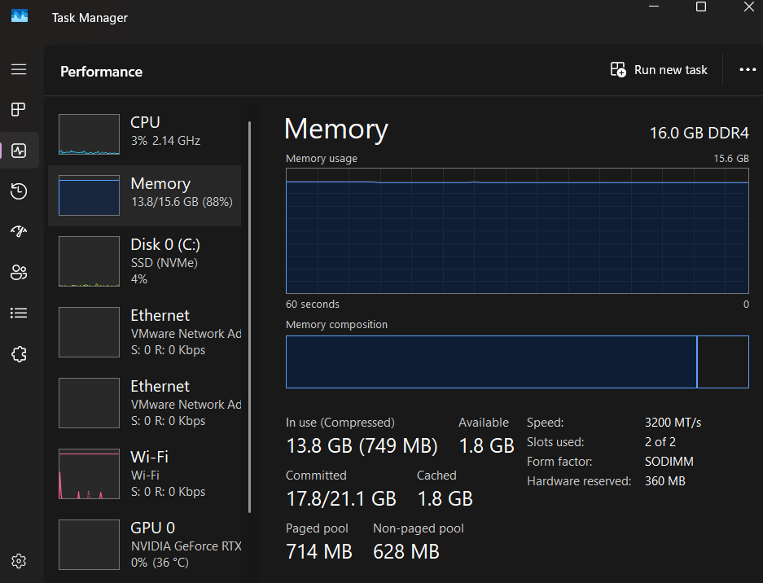
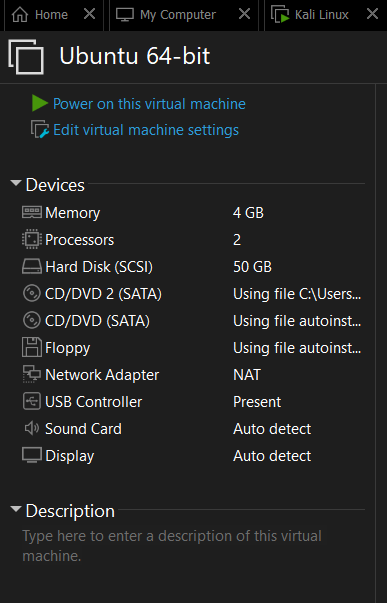
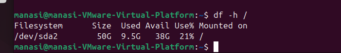
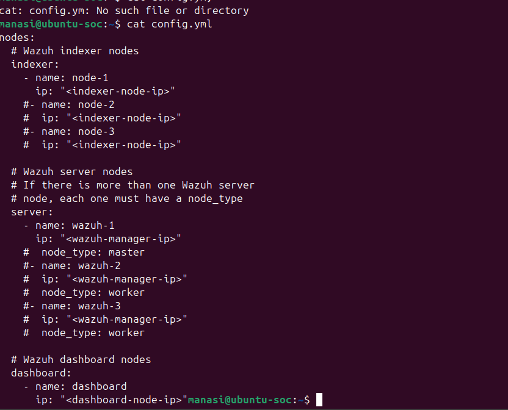
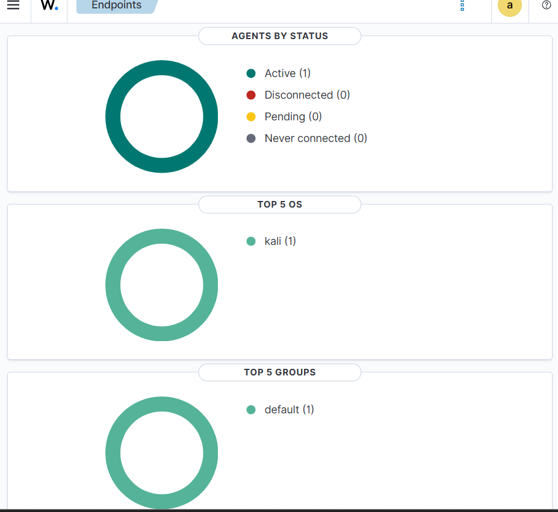
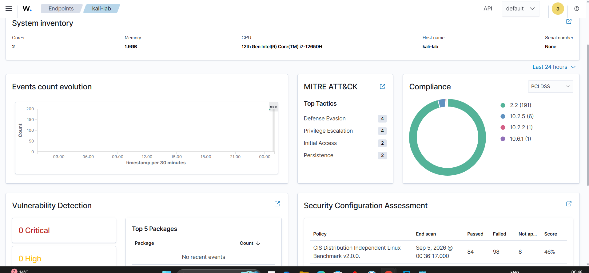

# Part 1: Lab Setup & Wazuh Deployment

[← Back to README](../README.md) | [Next: SSH Brute-Force Investigation →](02-ssh-bruteforce-investigation.md)

## Objective

Build a small but realistic SOC environment: a central Wazuh platform on Ubuntu and a monitored Kali Linux endpoint, ready to generate and detect security events.

## Lab Overview

| Item | Value |
|---|---|
| Virtualisation | VMware Workstation (NAT / lab virtual network) |
| Ubuntu | 24.04.4 LTS, hostname `ubuntu-soc`, IP 192.168.58.131 |
| Ubuntu role | Wazuh central server and SSH target |
| Ubuntu resources | 4 CPU cores, ~6 GB RAM, 50 GB disk |
| Kali | Hostname `kali-lab`, IP 192.168.58.130 |
| Kali role | Wazuh agent and controlled security-testing endpoint |
| Wazuh version | 4.14.7 |

```
Windows host
     |
VMware Workstation
     |
+-----------------------------+
|                             |
Kali Linux                 Ubuntu SOC
192.168.58.130             192.168.58.131
kali-lab                   ubuntu-soc
Wazuh Agent                Wazuh Server
controlled testing         Wazuh Indexer
                           Filebeat
                           Wazuh Dashboard
+-----------------------------+
```


*Figure 1: Windows Task Manager confirming the physical host had 16 GB RAM to support both VMs.*

---

## 1. Ubuntu System Baseline

### 1.1 Confirm the OS version

```bash
lsb_release -a
```

**Why:** Wazuh installation steps and package support depend on the operating system.
**Result:** Ubuntu 24.04.4 LTS (codename `noble`).

### 1.2 Update the system

```bash
sudo apt update
sudo apt upgrade -y
```

**Why:** Starting from a current system reduces avoidable package and dependency problems.
**Result:** Upgrade completed. A few packages were held back by phased updates, which did not affect the project.

### 1.3 Install utilities

```bash
sudo apt install curl wget git vim net-tools unzip -y
```

**Why:** For downloading files, editing configuration, checking networking and handling archives.

### 1.4 Check network address and connectivity

```bash
ip addr
ping -c 4 google.com
```

**Result:** Interface `ens33` had IPv4 address `192.168.58.131/24`. The ping returned 4/4 replies with 0% packet loss.
**SOC meaning:** This established the server's network identity before it became the central Wazuh host.

### 1.5 Check VM resources

```bash
free -h
lscpu
nproc
uptime
```

**Result:** Baseline showed about 5.7 GiB total memory with about 4.5 GiB available, and a load of 0.00.
**SOC meaning:** A resource baseline helps diagnose slowness or failures later, because you can compare health before and after changes.

### 1.6 Check disk space and expand storage

The first Ubuntu disk allocation was only 20 GB, which is too small for a SIEM that stores security data. I expanded the virtual disk to 50 GB in VMware, then extended the partition and filesystem.

```bash
df -h /
lsblk
findmnt -no FSTYPE /

sudo apt install cloud-guest-utils -y
sudo growpart /dev/sda 2
sudo resize2fs /dev/sda2
```

| Command | What it did |
|---|---|
| `cloud-guest-utils` | Provided the `growpart` tool |
| `growpart /dev/sda 2` | Expanded partition 2 on `/dev/sda` |
| `resize2fs /dev/sda2` | Expanded the ext filesystem to fill the partition |

**Verification:** `/dev/sda2` showed about 50 GB total with about 38 GB available.
**SOC meaning:** Wazuh generates and stores large volumes of data, so extra storage reduces the risk of running out of space during testing.


*Figure 2: VMware disk setting showing the virtual disk expanded to 50 GB. (The VM was later raised to 6 GB RAM and 4 CPU cores.)*


*Figure 3: Ubuntu confirming the expanded 50 GB filesystem.*

### 1.7 Set a meaningful hostname

```bash
hostnamectl
sudo hostnamectl set-hostname ubuntu-soc
```

**SOC meaning:** With several endpoints, clear names make alert triage faster and reduce confusion in logs and the Dashboard.

### 1.8 Create a recovery snapshot

```bash
sudo shutdown now
```

The VM was powered off and a clean VMware snapshot was saved as a baseline before deploying Wazuh.
**Why:** Security tooling and test activity change a system. A known-good restore point makes recovery easy.

---

## 2. SSH Setup

SSH was chosen as the first realistic authentication event source, so I could generate both normal and failed logins.

```bash
sudo apt install openssh-server -y
sudo systemctl enable --now ssh
sudo systemctl status ssh --no-pager
```

**Result:** SSH installed, enabled and confirmed active.

---

## 3. Wazuh Central Platform Deployment

### 3.1 Download the installation files

```bash
curl -sO https://packages.wazuh.com/4.14/wazuh-install.sh
curl -sO https://packages.wazuh.com/4.14/config.yml
```

### 3.2 Configure `config.yml`

I reviewed the default file, then set every node IP to the Ubuntu SOC server.

```yaml
nodes:
  indexer:
    - name: node-1
      ip: "192.168.58.131"
  server:
    - name: wazuh-1
      ip: "192.168.58.131"
  dashboard:
    - name: dashboard
      ip: "192.168.58.131"
```

**Why all three use the same IP:** This is a single-host deployment. The Indexer, Server and Dashboard are separate services running on one VM.


*Figure 4: Wazuh `config.yml` with the Ubuntu SOC IP used for the central components.*

### 3.3 Generate installation material

```bash
sudo bash wazuh-install.sh --generate-config-files
```

**Why:** Generates the certificates, keys and passwords the Wazuh components need.

### 3.4 Install the components

```bash
# Indexer: storage and search
sudo bash wazuh-install.sh --wazuh-indexer node-1

# Manager: analysis and detection (also installs Filebeat)
sudo bash wazuh-install.sh --wazuh-server wazuh-1

# Initialise the Indexer cluster and security
sudo bash wazuh-install.sh --start-cluster

# Dashboard: web interface
sudo bash wazuh-install.sh --wazuh-dashboard dashboard
```

**Lesson:** My first Dashboard installation failed because the Indexer security configuration had not been initialised. Reading the installer's error message showed the missing prerequisite (`--start-cluster`). Installation order matters.

**Result:** The Dashboard became available at `https://192.168.58.131`.

> **Security note:** The installer displays an administrator password. It is deliberately not recorded in this repository.

### 3.5 The four central components

| Component | Role |
|---|---|
| Wazuh Manager | The brain: processes events and evaluates detection rules |
| Wazuh Indexer | Storage: stores and indexes security data for searching |
| Wazuh Dashboard | The screen: alerts, events, endpoints and investigations |
| Filebeat | Data shipper: moves Wazuh alerts to the Indexer |

```
Security event → Wazuh Manager → Filebeat → Wazuh Indexer → Wazuh Dashboard
```

---

## 4. Troubleshooting: Dashboard "Server Is Not Ready Yet"

After installation, the Dashboard displayed *"Wazuh dashboard server is not ready yet."* Rather than restarting things blindly, I worked backwards from the symptom.

```bash
sudo systemctl status wazuh-dashboard --no-pager
sudo systemctl status wazuh-indexer --no-pager
sudo journalctl -u wazuh-indexer -n 100 --no-pager | grep -iE "error|exception|fatal"
```

| Step | Finding |
|---|---|
| Service status | Dashboard was active, but the **Indexer had failed**, so the problem was the Indexer, not the Dashboard |
| Indexer logs | The Indexer could not open `/var/log/wazuh-indexer/gc.log`. First the directory was missing, then it was a permissions problem |

**Fix:**

```bash
sudo mkdir -p /var/log/wazuh-indexer
id wazuh-indexer                                   # confirm service account (UID 997, GID 984)
sudo chown wazuh-indexer:wazuh-indexer /var/log/wazuh-indexer
sudo systemctl restart wazuh-indexer
sudo systemctl status wazuh-indexer --no-pager
```

**Result:** The directory became owned by `wazuh-indexer:wazuh-indexer` and the Indexer returned to an active state.

**Lesson:** When a security service fails, read its logs and check the service account's permissions instead of repeatedly restarting it without evidence.

(More troubleshooting is collected in the [troubleshooting log](05-troubleshooting-log.md).)

---

## 5. Kali Endpoint & Wazuh Agent

### 5.1 Confirm identity

```bash
hostname
ip -4 addr
```

**Observed:** hostname `kali-lab`, IP `192.168.58.130`.

### 5.2 Fix a hostname resolution warning

`sudo` reported *"unable to resolve host kali-lab"* because the local hosts file still used the previous hostname. I corrected `/etc/hosts`:

```
127.0.1.1 kali-lab
```

**Result:** Warning resolved.

### 5.3 Add the Wazuh repository and signing key

```bash
curl -s https://packages.wazuh.com/key/GPG-KEY-WAZUH | sudo gpg --dearmor -o /usr/share/keyrings/wazuh.gpg

echo "deb [signed-by=/usr/share/keyrings/wazuh.gpg] https://packages.wazuh.com/4.x/apt/ stable main" | sudo tee /etc/apt/sources.list.d/wazuh.list

sudo apt update
```

**Why:** The repository provides the official agent package, and the signing key lets APT verify package authenticity.

### 5.4 Install the agent (matching the server version)

```bash
sudo apt install wazuh-agent=4.14.7-1
```

**Result:** Wazuh Agent 4.14.7 installed.

### 5.5 Point the agent at the Manager

Edited `/var/ossec/etc/ossec.conf`:

```xml
<client>
  <server>
    <address>192.168.58.131</address>
  </server>
</client>
```

```bash
sudo grep -A 3 "<client>" /var/ossec/etc/ossec.conf
```

### 5.6 Start and verify the agent

```bash
sudo systemctl enable --now wazuh-agent
sudo systemctl status wazuh-agent --no-pager
```

**Result:** The agent was active and appeared as an **Active** endpoint in the Wazuh Dashboard.


*Figure 5: Wazuh Endpoints view showing the Kali endpoint as Active.*


*Figure 6: Kali endpoint view with system inventory and security-monitoring sections.*

---

## Part 1 Outcome

| Capability | Status |
|---|---|
| Ubuntu SOC server prepared (storage, hostname, snapshot) | Complete |
| Wazuh Indexer, Manager, Filebeat and Dashboard deployed | Complete |
| Indexer failure diagnosed and fixed | Complete |
| Kali agent onboarded and reporting | Complete |

The platform was now ready to receive real security events, starting with SSH authentication activity.

[Next: SSH Brute-Force Investigation →](02-ssh-bruteforce-investigation.md)
