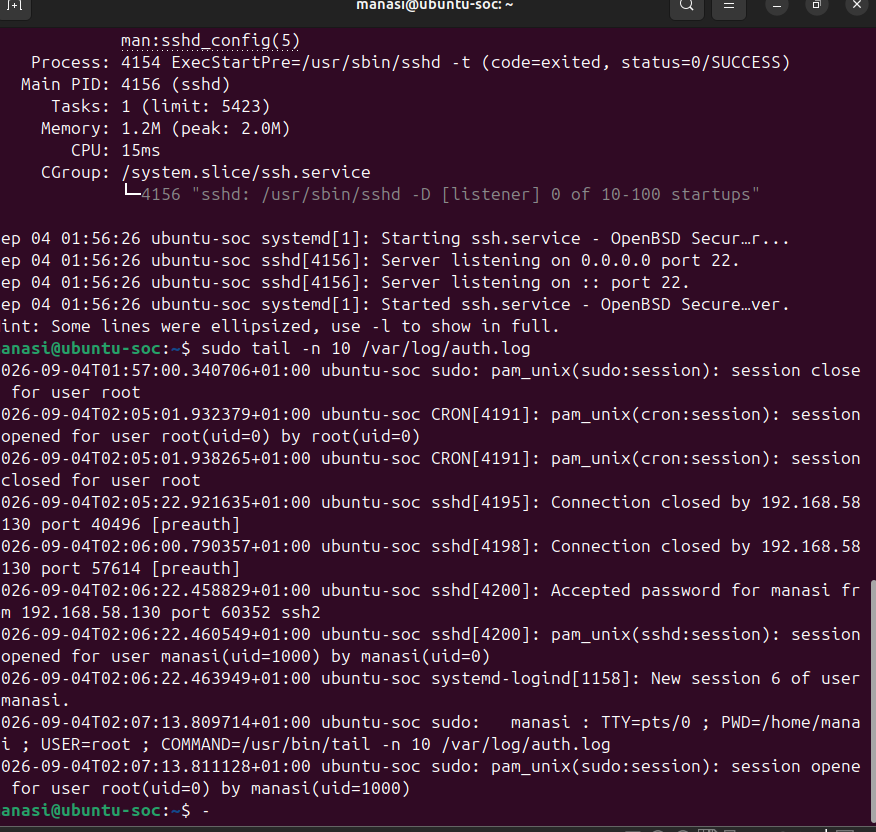
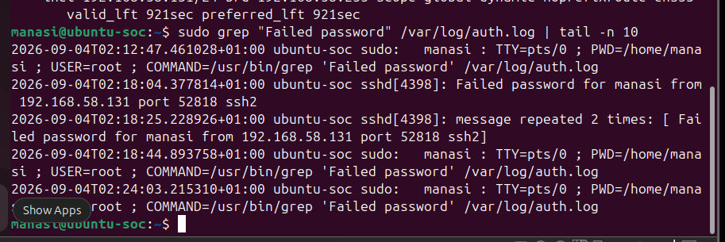
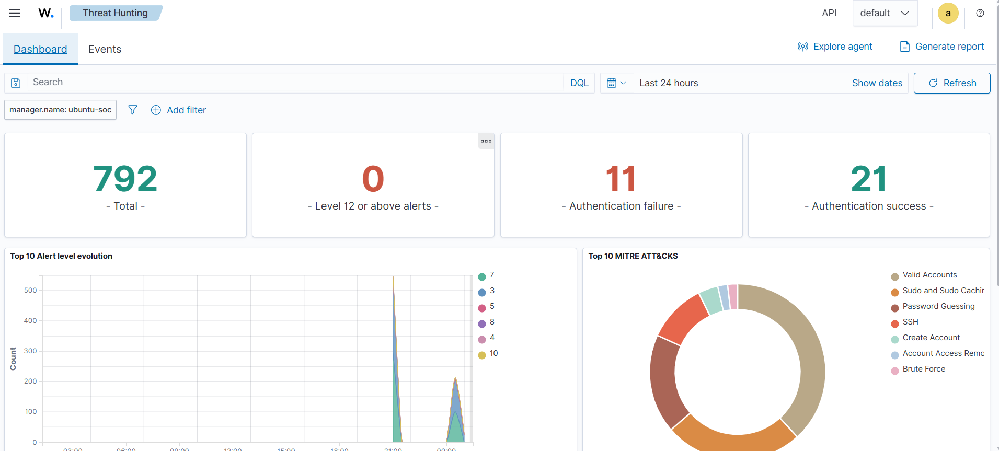
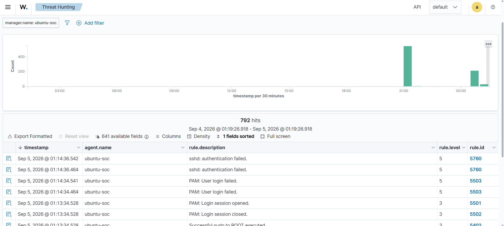
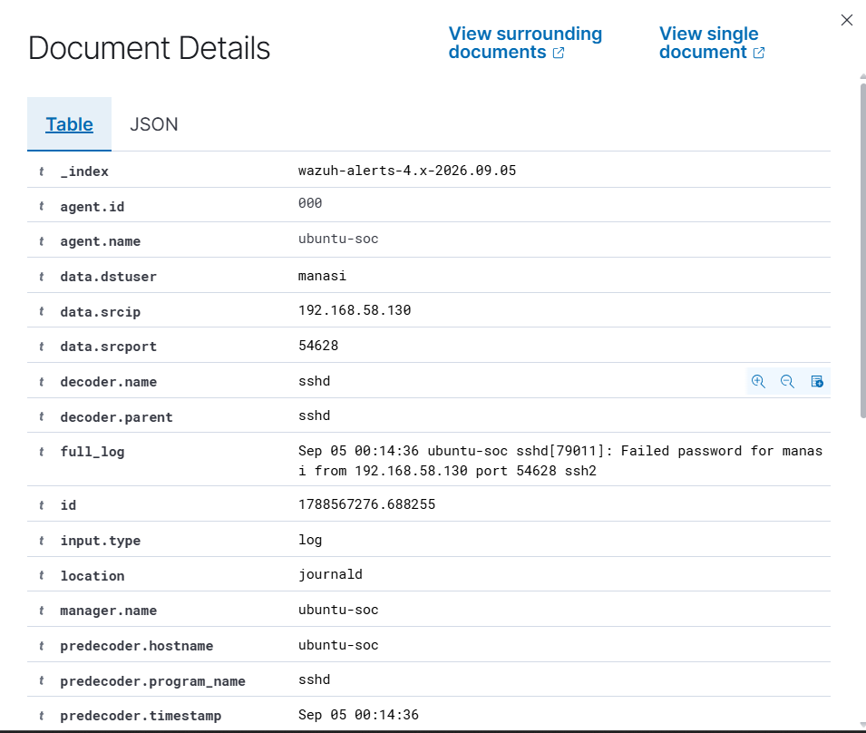
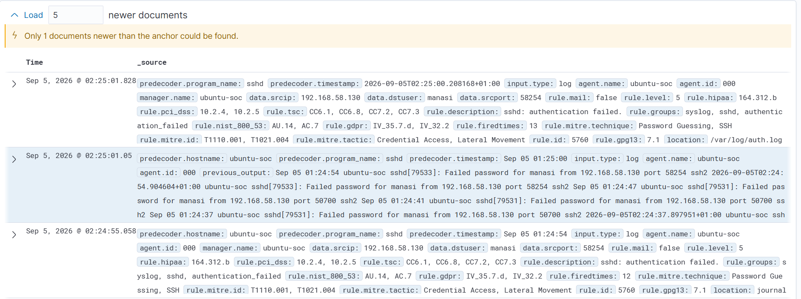

# Part 2: SSH Authentication Monitoring & Brute-Force Investigation

[← Previous: Lab Setup](01-lab-setup-and-deployment.md) | [README](../README.md) | [Next: File Integrity Monitoring →](03-file-integrity-monitoring.md)

## Objective

Start with a normal SSH login, create controlled failed logins, have Wazuh detect them, investigate the alert, and decide whether there was any evidence of successful access.

```
Normal activity → Failed authentication → Wazuh rule → Correlation → Alert → Investigation → Response
```

## Scenario Summary

| Item | Value |
|---|---|
| Source (controlled test host) | `kali-lab`, 192.168.58.130 |
| Target | `ubuntu-soc`, 192.168.58.131, SSH service |
| Targeted account | `manasi` |
| Detection rules | 5760 (single failure), 5763 (brute-force correlation) |
| MITRE ATT&CK | T1110: Brute Force (Credential Access) |
| Method | Manual repeated failed SSH logins (no password-cracking tool) |
| Outcome | Alert generated, source identified, **no successful login found** |

---

## 1. Establish a Normal Baseline

Before creating suspicious activity, I performed a legitimate login so I could see what normal looked like.

```bash
ssh manasi@192.168.58.131
```

**Observed on Ubuntu:** `Accepted password for manasi from 192.168.58.130`
**Meaning:** Kali successfully authenticated to Ubuntu. This was a normal lab event, separate from the later brute-force test.


*Figure 7: Ubuntu authentication log showing a successful SSH login from Kali.*

---

## 2. Create Controlled Failed Logins

From Kali, I deliberately entered incorrect passwords over SSH. SSH returned `Permission denied` and Ubuntu recorded `Failed password` events.

> **SOC meaning:** A failed authentication is an *event*, not automatically an *incident*. An analyst needs frequency, source, target and context before drawing conclusions.

### Validate at the source

I checked the original SSH records on Ubuntu rather than relying only on the SIEM view.

```bash
sudo journalctl -u ssh --no-pager | grep "Failed password" | tail -10
```

**Result:** Recent failures showed source IP `192.168.58.130` and target user `manasi`.


*Figure 8: Ubuntu SSH journal showing failed password events from the Kali source IP.*

---

## 3. Configure Wazuh to Monitor Authentication Logs

### 3.1 Check whether `auth.log` was already monitored

```bash
sudo grep -n -A 3 -B 2 "/var/log/auth.log" /var/ossec/etc/ossec.conf
```

**Result:** No matching block. `auth.log` was not explicitly listed as a log source.

### 3.2 Add `auth.log` as a log source

Added to `/var/ossec/etc/ossec.conf`:

```xml
<localfile>
  <log_format>syslog</log_format>
  <location>/var/log/auth.log</location>
</localfile>
```

The existing journald, `active-responses.log` and `dpkg.log` blocks were kept. Only the new block was added.

### 3.3 Validate and apply

```bash
sudo /var/ossec/bin/wazuh-analysisd -t
sudo systemctl restart wazuh-manager
sudo systemctl status wazuh-manager --no-pager
```

**Result:** The configuration test returned no error and the Manager stayed active after restart.

---

## 4. Threat Hunting: Understand the Event

The Threat Hunting view showed authentication failures and successes. The dashboard displayed **792 hits**, which is the number of event records matching the filter and time range. It does **not** mean 792 attacks.


*Figure 9: Wazuh Threat Hunting dashboard showing event volume and authentication counts.*

### 4.1 Individual events

The Events view showed:

```
rule.description: sshd: authentication failed.
rule.id: 5760
rule.level: 5
```

This was the individual failed-authentication detection. It was **not yet** proof of brute-force activity.


*Figure 10: Wazuh Events view showing SSH authentication failures and Rule 5760.*

### 4.2 Event fields

Opening the document details exposed the fields used for investigation:

```
agent.name:     ubuntu-soc
data.dstuser:   manasi
data.srcip:     192.168.58.130
data.srcport:   54628
decoder.name:   sshd
location:       journald
manager.name:   ubuntu-soc
full_log:       Failed password for manasi from 192.168.58.130 ...
```

> **Important distinction:** `agent.name` shows *where the event was collected* (`ubuntu-soc`). `data.srcip` shows *where the connection came from* (`192.168.58.130`). Seeing `ubuntu-soc` as the agent does not mean Ubuntu was the attacker.


*Figure 11: Wazuh Document Details showing source IP, target user, decoder and original log.*

---

## 5. Why Did Wazuh Detect It?

### 5.1 Rule 5760: single failure

```bash
sudo grep -R -n 'id="5760"' /var/ossec/ruleset/rules/
sudo sed -n '455,475p' /var/ossec/ruleset/rules/0095-sshd_rules.xml
```

Found in `0095-sshd_rules.xml` at line 455:

```xml
<rule id="5760" level="5">
    <if_sid>5700,5716</if_sid>
    <match>Failed password|Failed keyboard|authentication error</match>
```

**Meaning:** Rule 5760 matches individual SSH authentication failures. `Failed password` is exactly what appeared in the Ubuntu log. One failed login can be ordinary user error, so repeated failures are what matter.

### 5.2 Rule 5763: brute-force correlation

```bash
sudo grep -R -n -i "brute force" /var/ossec/ruleset/rules/ | head -20
sudo sed -n '475,490p' /var/ossec/ruleset/rules/0095-sshd_rules.xml
```

```xml
<rule id="5763" level="10" frequency="8" timeframe="120" ignore="60">
    <if_matched_sid>5760</if_matched_sid>
    <same_source_ip/>
    <description>sshd: brute force trying to get access to the system. Authentication failed.</description>
    <mitre>
      <id>T1110</id>
    </mitre>
```

| Condition | Meaning |
|---|---|
| `if_matched_sid 5760` | Counts matching single-failure events |
| `same_source_ip` | Failures must come from the same source IP |
| `frequency="8"` | 8 matching events are required |
| `timeframe="120"` | Within a 120-second window |
| `level="10"` | High severity |
| `mitre T1110` | Mapped to Brute Force (Credential Access) |

---

## 6. The Brute-Force Alert

Repeated failed SSH attempts were made from Kali until the correlation condition was reached.

```
SSH failure → Rule 5760 → repeated failures from same source → Rule 5763 → Level 10 → MITRE T1110
```

| Field | Value |
|---|---|
| Rule | 5763, Level 10 |
| Source IP | 192.168.58.130 (Kali) |
| Target user | `manasi` |
| Collection endpoint | `ubuntu-soc` |
| MITRE | T1110, Credential Access |
| `firedtimes` | 1 (this is a rule-fire count, not a count of attacks) |


*Figure 12: Wazuh Rule 5763 alert showing Level 10, frequency 8, MITRE T1110 and source IP.*

### Surrounding events

The surrounding-documents view showed repeated failed SSH events around the alert, all tied to `192.168.58.130` and the `manasi` account.


*Figure 13: Surrounding documents used to reconstruct the SSH activity sequence.*

---

## 7. Build and Validate the Timeline

```bash
sudo journalctl -u ssh --since "2026-09-05 02:20:00" --until "2026-09-05 02:27:00" --no-pager | grep "Failed password"
```

**Observed:** Repeated failures from `192.168.58.130` between approximately 02:22:47 and 02:25:00.

> **Evidence-handling note:** I did not claim that the eight terminal lines visible were precisely the eight events used by the correlation rule. The displayed sequence spans slightly more than 120 seconds, and the Wazuh surrounding view can show repeated timestamp representations. What the evidence does support is that the Rule 5763 alert fired, confirming Wazuh's correlation logic was met.

---

## 8. Did the Attack Succeed?

I searched the same window for successful authentication.

```bash
sudo journalctl -u ssh --since "2026-09-05 02:20:00" --until "2026-09-05 02:27:00" --no-pager | grep "Accepted"
```

**Result:** No output, so there was no successful SSH authentication in the incident window.

**Context:** The successful login seen on 4 September came before the brute-force simulation on 5 September, so it was treated as a separate legitimate lab event.

---

## 9. Review SSH Configuration and Account Status

### 9.1 Effective SSH settings

```bash
sudo sshd -T | grep -E 'passwordauthentication|permitrootlogin'
```

**Observed:** `passwordauthentication yes`, `permitrootlogin without-password`.

**Meaning:** Password authentication was enabled and root password login over SSH was not permitted.

**Lab decision:** Password authentication was kept because this exercise depended on password-based failures. No hardening change was made during this first investigation (SSH hardening is covered later in [Part 4](04-security-configuration-assessment.md)).

### 9.2 Targeted account

```bash
sudo passwd -S manasi
```

**Observed:** `manasi P 2026-09-03 0 99999 7 -1`

**Meaning:** The account had a password set and was not locked. No account remediation was needed because no compromise was found.

---

## 10. Incident Response Summary

| Stage | What I did | Finding / decision |
|---|---|---|
| **Identify** | Reviewed the Rule 5763 Level 10 alert | Repeated SSH authentication failures detected |
| **Validate** | Checked the Ubuntu SSH journal | Failures were real and came from 192.168.58.130 |
| **Investigate** | Reviewed user, source IP, rule, decoder and timeline | Target was `manasi` on `ubuntu-soc`; mapped to T1110 |
| **Contain** | Considered blocking the source | No permanent block, because Kali is the controlled lab source |
| **Remediate** | Reviewed SSH and account configuration | No immediate lab change; production hardening noted as a recommendation |
| **Recover** | Checked for successful access | No successful SSH authentication in the incident window |
| **Document** | Recorded alert, evidence and reasoning | Closed as a controlled brute-force detection test with no evidence of compromise |

A formal write-up is in the [incident report](../reports/incident-report-ssh-bruteforce.md).

---

## Final Finding

A controlled SSH password-guessing scenario was successfully detected in the Wazuh SOC lab. The Kali endpoint (192.168.58.130) generated repeated authentication failures against the Ubuntu SSH service. Wazuh identified individual failures with Rule 5760 and correlated repeated failures using Rule 5763, producing a Level 10 alert mapped to MITRE ATT&CK T1110 (Brute Force).

The alert was validated against Ubuntu's SSH journal. The investigation identified the source IP, targeted account, SSH decoder, original log and surrounding events. No successful SSH authentication was identified in the investigated incident window.

---

## What This Demonstrates

- Why one failed login differs from repeated suspicious failures
- What Rule 5760 detects, and why Rule 5763 triggered (frequency, timeframe, same source IP)
- How to identify the true source of an attempt (`data.srcip` vs `agent.name`)
- How to validate a SIEM alert against the original system logs
- How to check whether an attempted attack actually succeeded
- How to read raw Wazuh rule files instead of treating alerts as a black box

[Next: File Integrity Monitoring →](03-file-integrity-monitoring.md)
