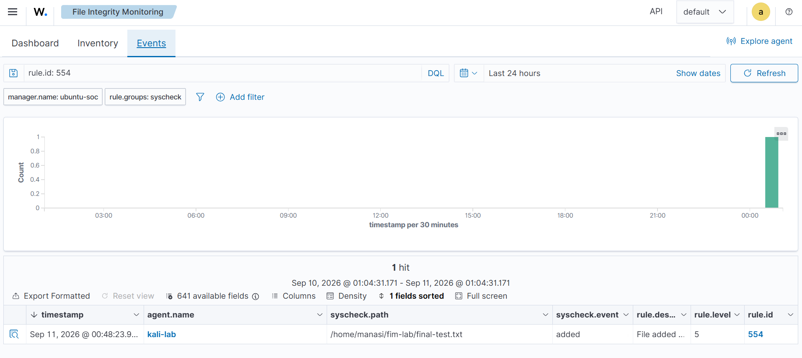
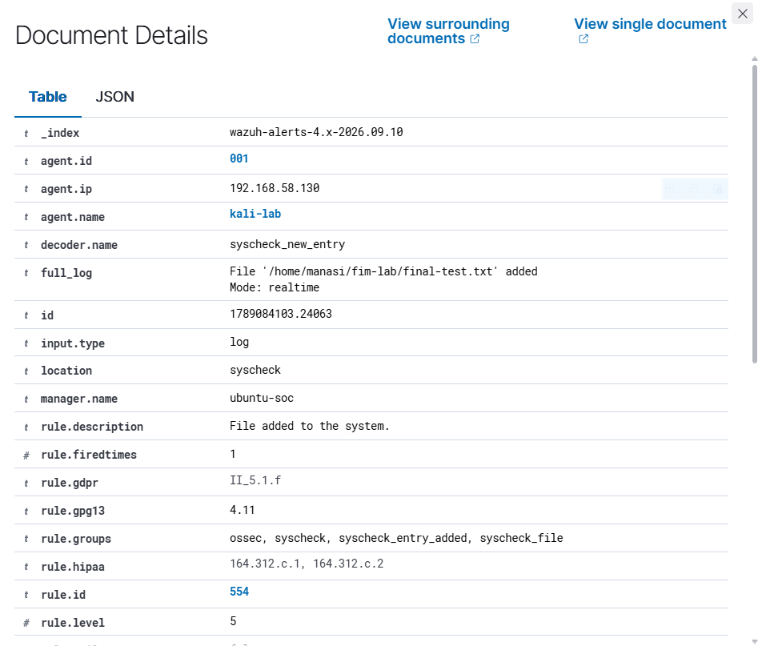
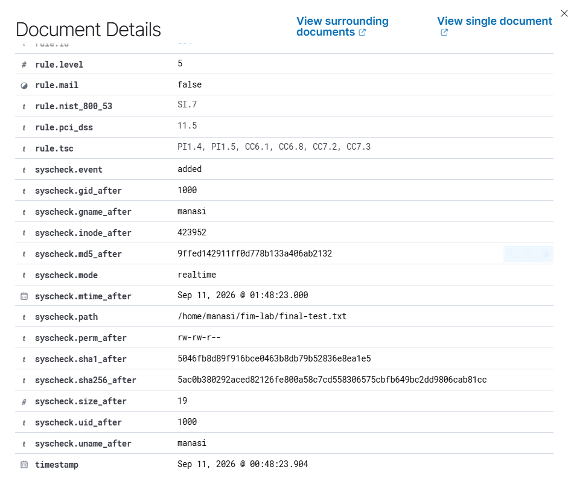
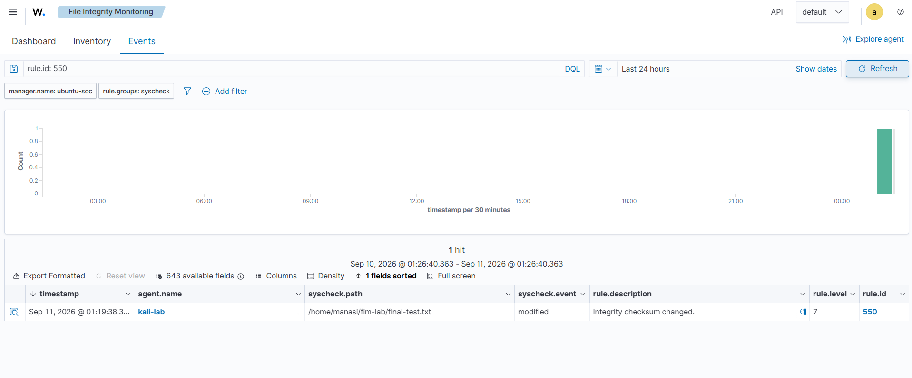

# Part 3: File Integrity Monitoring (FIM)

[← Previous: SSH Brute-Force Investigation](02-ssh-bruteforce-investigation.md) | [README](../README.md) | [Next: Security Configuration Assessment →](04-security-configuration-assessment.md)

## Objective

Confirm that Wazuh can detect three common file-integrity events on the Kali endpoint: a file being **created**, **modified** and **deleted**. I used a dedicated test directory so no real operating-system files had to be changed.

## Results at a Glance

| Test | Rule | Level | Result | MITRE context shown by Wazuh |
|---|---|---|---|---|
| File creation | 554 | 5 | Detected in real time | n/a |
| File modification | 550 | 7 | Detected in real time | T1565.001 Stored Data Manipulation |
| File deletion | 553 | 7 | Detected in real time | T1070.004 File Deletion, T1485 Data Destruction |

---

## 1. Check the Existing FIM Configuration

I read the current configuration before changing anything, so I could keep the existing settings and only add what the lab needed.

```bash
sudo sed -n '/<syscheck>/,/<\/syscheck>/p' /var/ossec/etc/ossec.conf
```

**Existing settings:**
- FIM enabled, `scan_on_start` enabled
- Scheduled scan every 43200 seconds (12 hours)
- Already monitoring `/etc`, `/usr/bin`, `/usr/sbin`, `/bin`, `/sbin`, `/boot`

**Decision:** Keep the defaults and add a separate test path.

---

## 2. Create a Safe Test Directory

```bash
mkdir -p ~/fim-lab
ls -ld ~/fim-lab
```

**Result:** `/home/manasi/fim-lab` created, owned by `manasi:manasi`.

## 3. Add the Directory to FIM

Added to the existing `<syscheck>` section of `/var/ossec/etc/ossec.conf`:

```xml
<directories realtime="yes">/home/manasi/fim-lab</directories>
```

Existing directories and ignore rules were not removed.

## 4. Validate and Restart

```bash
sudo /var/ossec/bin/wazuh-syscheckd -t      # no output = configuration valid
sudo systemctl restart wazuh-agent
sudo systemctl status wazuh-agent --no-pager
```

**Result:** Configuration passed validation and the agent returned to an active state.

---

## 5. First Test: No Alert (and Why)

```bash
echo "SOC FIM test" > ~/fim-lab/test-file.txt
ls -l ~/fim-lab/
```

The file was created, but no alert appeared in the Dashboard. Instead of guessing, I investigated.

The Syscheck log showed the **initial FIM scan had started but not finished**, so the file was created before real-time monitoring was fully active.

> **Lesson:** For a clean real-time test, make the change *after* the initial scan has completed.

---

## 6. Troubleshooting the Full Event Path

A missing alert can be caused by any link in the chain:

```
Agent → Manager → Filebeat → Indexer → Dashboard
```

I checked each one in turn.

### 6.1 Syscheck status on Kali

```bash
sudo grep -i "syscheck" /var/ossec/logs/ossec.log | tail -20
sudo grep -iE "File integrity monitoring scan (started|ended)" /var/ossec/logs/ossec.log | tail -10
```

**Finding:** `/home/manasi/fim-lab` was configured for real-time monitoring, but only the scan-*started* message was visible.

### 6.2 The Wazuh Manager was dead

```bash
sudo systemctl status wazuh-manager --no-pager -l
```

**Finding:** The Manager was **inactive (dead)**. That explained why the Kali agent could not deliver its events, even though the agent service itself was running.

```bash
sudo systemctl enable --now wazuh-manager
sudo systemctl status wazuh-manager --no-pager
```

**Result:** The Manager started, with `wazuh-remoted`, `wazuh-authd`, `wazuh-analysisd`, `wazuh-syscheckd` and `wazuh-logcollector` all running.

### 6.3 Verify the communication ports

The Kali agent log had shown connection failures to TCP 1514 and 1515, so I checked whether Ubuntu was listening.

```bash
sudo ss -lntp | grep -E ':1514|:1515'
```

**Result:** 1514 was listening via `wazuh-remoted` and 1515 via `wazuh-authd`.

**Meaning:** This separated a *Manager communication* problem from an *FIM configuration* problem.

### 6.4 Confirm Kali reconnected and real-time FIM started

```bash
sudo tail -20 /var/ossec/logs/ossec.log
```

**Observed:** Kali connected to 192.168.58.131 on port 1514, the agent came online, the initial FIM scan ended, and real-time monitoring started. The scan finishing at 00:45:45 explained why the earlier test file produced no immediate event.

### 6.5 Filebeat was also dead

```bash
sudo filebeat test output
```

**Result:** Filebeat could reach the Indexer at `https://192.168.58.131:9200` (DNS, connection, TLS handshake and communication all succeeded).

```bash
sudo systemctl status filebeat --no-pager
```

**Finding:** Filebeat was **inactive (dead)**. Wazuh alerts could exist locally on the Manager but would never be forwarded to the Indexer or Dashboard.

```bash
sudo systemctl enable --now filebeat
sudo systemctl status filebeat --no-pager
```

**Result:** Filebeat running and enabled at boot.

---

## 7. Clean Test 1: File Creation

The change was made only after the scan ended, the agent was online and real-time FIM was active.

```bash
echo "FIM detection test" > ~/fim-lab/final-test.txt
ls -l ~/fim-lab/
```

**Result:** Wazuh detected the event and it appeared in the Dashboard.



*Figure 14: Wazuh FIM Events showing `final-test.txt` as an added file.*



*Figure 15: Document Details for the file-created event.*



*Figure 16: Creation event metadata, permissions, ownership and hashes.*

**Alert:** Rule 554, Level 5, "File added to the system". Agent `kali-lab`, path `/home/manasi/fim-lab/final-test.txt`, mode `realtime`.

**Metadata recorded:**

| Attribute | Value |
|---|---|
| Size | 19 bytes |
| Permissions | `rw-rw-r--` |
| UID / GID | 1000 / 1000 |
| Owner / group | manasi |
| Inode | 423952 |
| Hashes | MD5, SHA-1 and SHA-256 recorded |

**Interpretation:** Wazuh detected a new file in a monitored location in real time.

---

## 8. Clean Test 2: File Modification

```bash
echo "Second line added" >> ~/fim-lab/final-test.txt
```

The `>>` operator appended data to the existing file, changing it while keeping the same path.



*Figure 17: Wazuh FIM Events showing `final-test.txt` as modified.*

### Investigating the alert

```bash
sudo grep -i "final-test.txt" /var/ossec/logs/alerts/alerts.json | tail -5
```

**Alert:** Rule 550, Level 7, "Integrity checksum changed", mode `realtime`, event `modified`.

| What changed | Before → After |
|---|---|
| Size | 19 → 37 bytes |
| MD5, SHA-1, SHA-256 | All changed |
| Changed attributes listed by Wazuh | size, mtime, and the three hashes |
| Inode | Unchanged (423952) |

**Why the inode matters:** An unchanged inode is consistent with the *same file being modified*, rather than a different file being created in its place.

**MITRE context:** Wazuh mapped this to T1565.001 (Stored Data Manipulation). Here the change was deliberate, so it was authorised test activity, not malicious manipulation.

---

## 9. Clean Test 3: File Deletion

A fresh file was created after real-time FIM was working, so the deletion test had a clear baseline.

```bash
echo "FIM deletion test" > ~/fim-lab/deletion-test.txt
rm ~/fim-lab/deletion-test.txt
```

### Verify the alert

```bash
sudo grep -i "deletion-test.txt" /var/ossec/logs/alerts/alerts.json | tail -5
```

**Alert:** Rule 553, Level 7, "File deleted". Agent `kali-lab`, path `/home/manasi/fim-lab/deletion-test.txt`, mode `realtime`, event `deleted`.

**MITRE mapping shown by Wazuh:** T1070.004 (File Deletion) and T1485 (Data Destruction).

**Interpretation:** The rule correctly detected deletion of a monitored file. Because the deletion was intentional lab activity, it was classified as authorised test activity.

---

## 10. SOC Interpretation of FIM Alerts

A FIM alert is **not automatically malicious**. Files change because of routine administration, software installs, updates and maintenance.

An analyst should check:
- the endpoint, file path and event type
- the time of the change
- owner, permissions and metadata
- hashes (before and after)

...and then decide whether the change was **expected**. In this exercise, every change was generated by me and classified as authorised test activity.

---

## 11. Lessons Learned

- FIM configuration can be correct while the wider alert path is broken. The agent, Manager, Filebeat, Indexer and Dashboard all need to be operational.
- The initial FIM scan must finish before real-time monitoring is fully active.
- With the Manager down, Kali could not send events even though its own agent service was running.
- Checking ports 1514 and 1515 helped separate a Manager communication problem from an FIM configuration problem.
- With Filebeat down, alerts could be generated locally but never reached the Dashboard.
- Checking `alerts.json` confirmed an event had actually been generated before I troubleshooted Dashboard visibility.

---

## Outcome

The three tests show that the Wazuh Agent, Manager, Filebeat, Indexer and Dashboard work together to detect and present file-integrity events from the Kali endpoint.

[Next: Security Configuration Assessment →](04-security-configuration-assessment.md)
