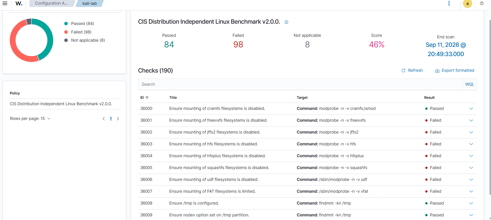
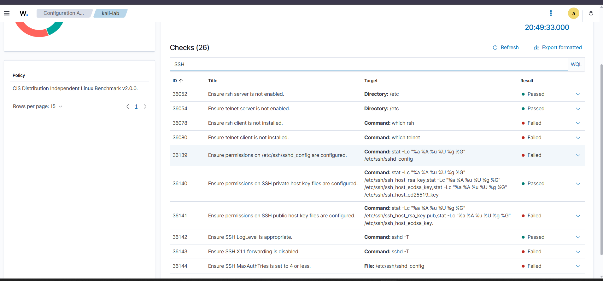
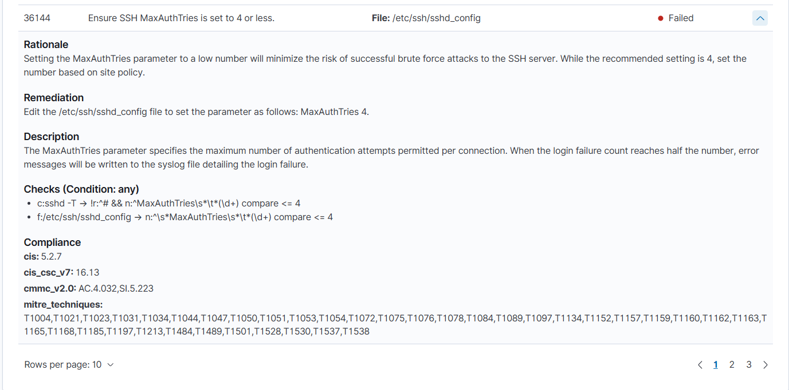

# Part 4: Security Configuration Assessment (SCA)

[← Previous: File Integrity Monitoring](03-file-integrity-monitoring.md) | [README](../README.md) | [Next: Troubleshooting Log →](05-troubleshooting-log.md)

## Objective

Use Wazuh Security Configuration Assessment to find a practical SSH hardening weakness on the Kali endpoint, understand why the check failed, fix the setting, and confirm Wazuh reports the control as **passed** after a rescan.

I kept this deliberately small. Rather than trying to fix every failed benchmark check, I chose one finding that connects directly to the earlier [SSH brute-force investigation](02-ssh-bruteforce-investigation.md).

## Summary

| Stage | Finding / action | Result |
|---|---|---|
| Initial assessment | CIS check **36144** failed | SSH `MaxAuthTries` above the recommended limit |
| Effective config check | `sshd -T` returned `maxauthtries 6` | Actual setting confirmed |
| Config review | `#MaxAuthTries 6` was commented out | SSH was using the default value |
| Remediation | Enabled `MaxAuthTries 4` | One targeted change |
| Validation | `sshd -t` returned no error | Syntax valid |
| Service reload | Restarted SSH | Service active |
| Verification | Restarted agent and rescanned | Check 36144 **Passed** |

---

## 1. Check the Existing SCA Configuration

```bash
sudo sed -n '/<sca>/,/<\/sca>/p' /var/ossec/etc/ossec.conf
```

```xml
<sca>
    <enabled>yes</enabled>
    <scan_on_start>yes</scan_on_start>
    <interval>12h</interval>
    <skip_nfs>yes</skip_nfs>
</sca>
```

**Why:** I checked before changing anything. SCA was already enabled, scanning on agent start and every 12 hours, so no module configuration was needed.

---

## 2. Review the Initial Results

**Policy:** CIS Distribution Independent Linux Benchmark v2.0.0

| Passed | Failed | Not applicable | Total | Score |
|---|---|---|---|---|
| 84 | 98 | 8 | 190 | 46% |



*Figure 18: Initial Kali SCA results showing the CIS benchmark and 46% score.*

**Approach:** The 98 failed checks were **not** treated as 98 incidents. SCA reports configuration gaps, not compromises. The goal was to pick one meaningful control and investigate it properly.

---

## 3. Select a Finding

**Selected check:** ID **36144**, *Ensure SSH MaxAuthTries is set to 4 or less.* Initial result: **Failed**.



*Figure 19: SSH-related SCA checks on Kali, including failed check 36144.*



*Figure 20: Expanded SCA check 36144 showing rationale, remediation and check logic.*

**Why this one:** `MaxAuthTries` controls how many authentication attempts are allowed per SSH connection, so it ties directly to the password-guessing activity I had just investigated. The benchmark recommends 4 or fewer to reduce the opportunity for repeated guessing within one connection.

---

## 4. Verify the Effective Setting

```bash
sudo sshd -T | grep '^maxauthtries'
```

**Result:** `maxauthtries 6`

**Meaning:** SSH allowed 6 attempts, which does not meet the requirement of 4 or less.

**Why `sshd -T`:** It shows the *effective* configuration the SSH daemon is actually using, rather than trusting a single line in a file.

## 5. Find Where the Value Comes From

```bash
sudo grep -nE '^[[:space:]]*#?[[:space:]]*MaxAuthTries' /etc/ssh/sshd_config
```

**Result:** The main file contained only a commented default: `#MaxAuthTries 6`.

I also searched the SSH configuration directory for any other active `MaxAuthTries` setting. None overrode it, so the effective value stayed at the default of 6.

---

## 6. Remediate

Edited `/etc/ssh/sshd_config`:

```diff
- #MaxAuthTries 6
+ MaxAuthTries 4
```

**Why:** A commented line has no effect. Replacing it with an active line makes SSH use the benchmark-recommended value.
**Scope:** No other SSH settings were changed.

## 7. Validate Before Restarting

```bash
sudo sshd -t
```

**Result:** No output, so the syntax is valid and it is safe to restart.

## 8. Confirm the Effective Value

```bash
sudo sshd -T | grep '^maxauthtries'
```

**Result:** `maxauthtries 4`

This confirms the change affected the effective configuration, not just the text file.

## 9. Restart SSH

```bash
sudo systemctl restart ssh
sudo systemctl status ssh --no-pager
```

**Result:** `Active: active (running)`

---

## 10. Rescan and Verify

SCA is configured with `scan_on_start=yes`, so restarting the agent triggers a fresh assessment.

```bash
sudo systemctl restart wazuh-agent
sudo tail -30 /var/ossec/logs/ossec.log | grep -iE "sca|Evaluation"
```

**Log result:** The SCA module started, loaded the Linux policy, evaluated it, and finished the scan in about 12 seconds. Key messages: *Evaluation of `sca_distro_independent_linux.yml` finished* and *Security Configuration Assessment scan completed*.

**Final result:** Check 36144 moved from **Failed** to **Passed**.


*Figure 21: SCA check 36144 after remediation, showing Passed.*

---

## SOC Interpretation

This was treated as a **security-hardening finding, not an incident**. SCA identified a configuration condition that could increase exposure. It did not mean the system had been compromised.

The remediation followed a controlled sequence:

```
Identify failed control → Verify effective config → One targeted change
→ Validate syntax → Restart service → Rescan → Confirm Failed → Passed
```

This also shows the difference between a **finding** (found by assessment) and an **alert-driven incident** (found by detection, like the Rule 5763 brute-force alert).

---

## Lessons Learned

- A low SCA score does not mean every failed check is a separate incident.
- Verify the *effective* configuration before changing a setting.
- A commented-out line looks like a setting but has no effect.
- Validate the change (`sshd -t`) before restarting the service.
- Rescan after remediation so the fix is verified rather than assumed.
- The useful outcome for an analyst is the whole chain: **finding → validation → remediation → verification**.

---

## Project Status

| Area | Status |
|---|---|
| SOC lab and VMware environment | Complete |
| Wazuh Indexer, Manager, Dashboard, Filebeat | Complete |
| Kali agent onboarding | Complete |
| SSH brute-force detection and investigation | Complete |
| File Integrity Monitoring (create / modify / delete) | Complete |
| SCA: identify and remediate `MaxAuthTries` | Complete |

[Next: Troubleshooting Log →](05-troubleshooting-log.md)
